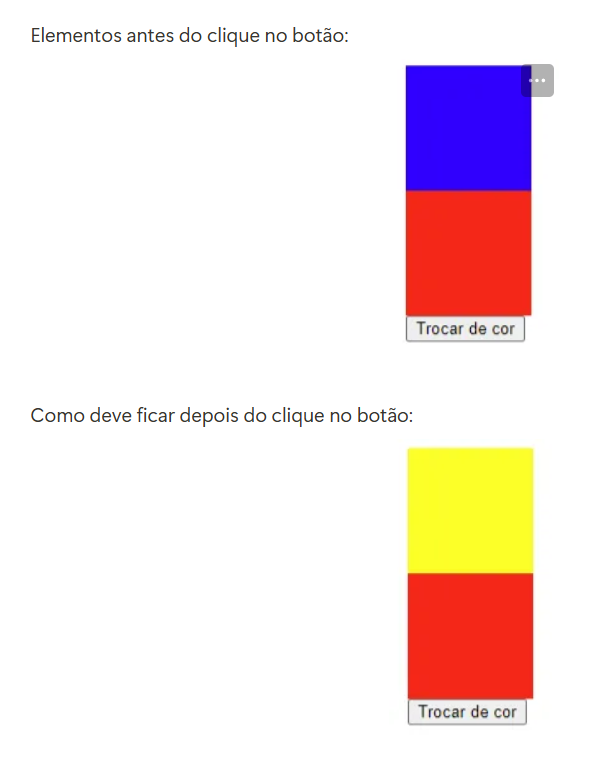

# Alterando estilos de elementos usando Eventos do JS

## 🧩 Um execício para fazer uma div mudar de cor após o clique do botão

Esse exercício se consiste em fazer uma div mudar de background azul para amarelo quando o botão é clicado pelo usuário.

## 🖼️ Imagem exemplo

##  Tecnologias utilizadas
🚀
- HTML
- CSS
- JavaScript

## 🗻 Desafios

Nessa seção farei uma breve citação dos meus desafios nesse exercício ⬇️.

Foi muito desafiador fazer algo tão simples para mim que estou começando agora no JS, foi bem difícil fazer o botão funcionar mas depois de feito meu cérebro entendeu um pouco mais sobre essa famosa linguagem de programação.

## 🧑🏽‍💻 Coisas que aprendi

Nesse exerício tudo foi um aprendizado para mim desde a criação do HTML até o JS.

## 🎯 Desenvolvimento contínuo

Desejo continuar aprendendo mais sobre todos esses conceitos de JS e saber bem quando usá-los para ter um código o mais limpo e organizado possível.

## 🙏 Agradecimentos

Aqui venho agradecer a toda equipe do DevQuest por todas instruções e toda ajuda que me foi dado nesse exercício.

